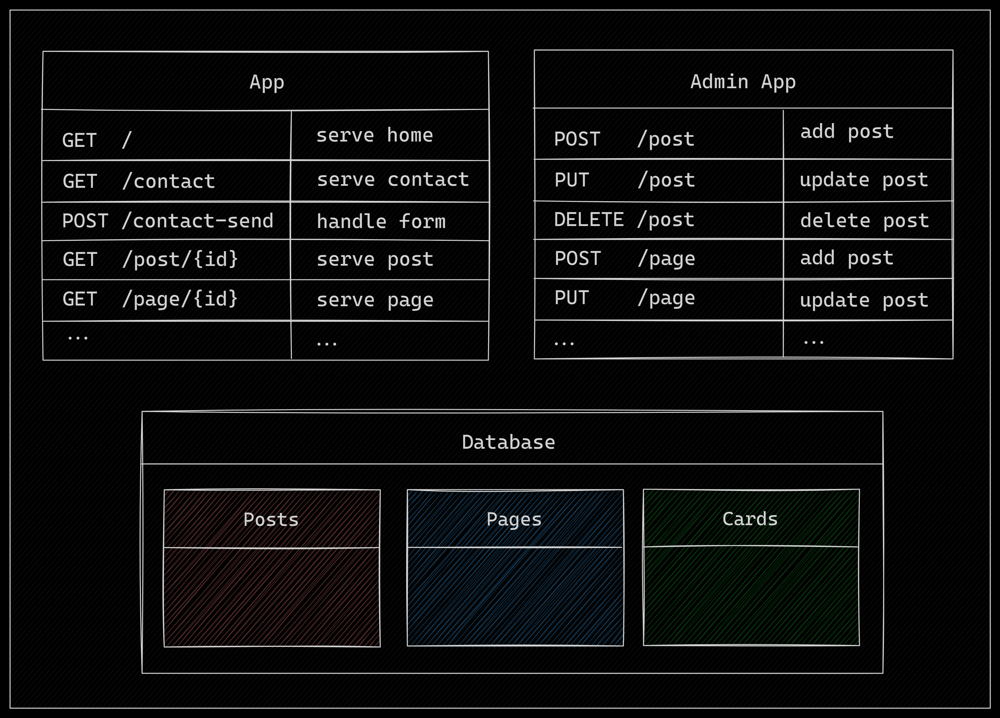

# Urchin 🐚

Urchin is a headless CMS (Content Management System) written in Golang, designed to be fast, efficient, and easily extensible. It allows you to
create a website or blog, with any template you like, in only a few
commands.


## Features 🚀

- [x] **Headless Architecture:** Adding pages, posts, or forms should all
  be done with easy requests to the API.
- [x] **Golang-Powered:** Leverage the performance and safety of one of the
  best languages in the market for backend development.
- [x] **SQL Database Integration:** Store your posts and pages in SQL databases for reliable and scalable data storage.
- [ ] **Post**: We can add, update, and delete posts. Posts can be served
  through a unique URL.
- [ ] **Pages**: TODO.
- [ ] **Menus**: TODO
- [ ] **Live Reload** through the use of `air`.

## Installation

Ensure you have Golang installed on your system before proceeding with the installation.

```bash
go get -u github.com/username/urchin
```

## Example - Running the App

First, ensure you have the neccesary libraries to run the application
```bash
make install-tools
```

Following that, make sure you run the Goose migrations for the database.
We recommend creating a database called `urchin` and running the following
command:

```bash
GOOSE_DRIVER="mysql" GOOSE_DBSTRING="root:root@/gocms" goose up
```

Replace the database connection string with the appropriate string
dependending on where your database is.

After you've replaced the default template files with your prefered
template, simply build and start the app with the following commands.

```bash
go build
./urchin
```

This will start Urchin on `http://localhost:8080`. You can customize
the configuration by providing the necessary environment variables.

For more information, see the [configuration settings](#configuration).

## Example - Running with Docker Compose

To run with `docker-compose`, use the following
command:

```bash
docker-compose up
```

This will start two containers: one containing the `urchin` app,
serving on port `8080`, and another one serving the `mariadb`
database internally. This will also run the migrations automatically
to setup the database!

## Architecture

Currently, the architecture of `urchin` is still in its early days.
The plan is to have two main applications: the public facing application
to serve the content through a website, and the admin application that
can be hidden, where users can modify the settings, add posts, pages, etc.



In the above image, you can see the two applications running alongside,
and they share a database connection where the data is actually stored.
The list below explains some of the data intended to be stored in the
database:

- **posts**: a table where each row is an individual post, containing
  the title, content, and any other relevant data.
- **pages**: a table where HTML can be stored to be served as individual
  pages on a website.
- **cards**: Still TODO. Need to decide how this will allow users to display
  menu-like pages with cards.

## Dependencies

Urchin relies on the following Golang dependencies:

- [Gin](github.com/gin-gonic/gin) as the web framework for Golang.
- [ZeroLog](https://github.com/rs/zerolog) for logging.

## Configuration

The runtime configuration is handled through reading the
necessary environment variables. This approach was chosen as
it makes integrating `envfile`s quite easy.

The following list outlines the environment variables needed.

- `URCHIN_DATABASE_ADDRESS` should contain the database addres,
  e.g. `localhost`.
- `URCHIN_DATABASE_PORT` should be the connection port to the
  database. For example `3306`.
- `URCHIN_DATABASE_USER` is the database username.
- `URCHIN_DATABASE_PASSWORD` needs to contain the database
  password for the given user.

## License

Urchin is released under the MIT License. See LICENSE (TODO) for
details. Feel free to fork, modify, and use it in your projects!