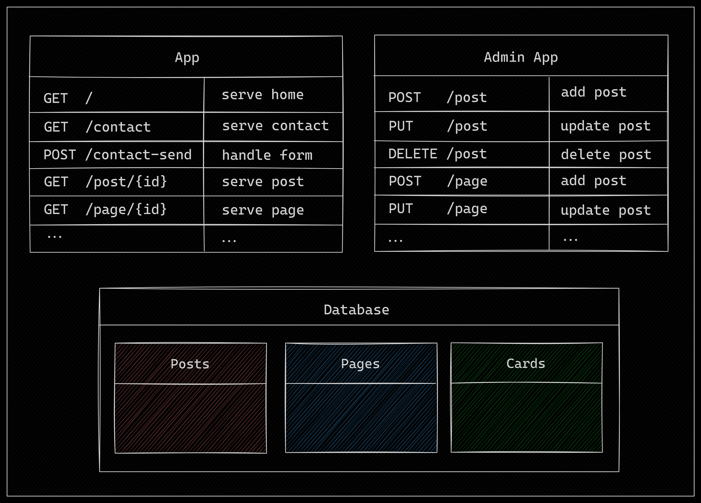

# Urchin 🐚

Urchin is a headless CMS (Content Management System) written in Golang,
designed to be fast, efficient, and easily extensible. It allows you to
create a website or blog, with any template you like, in only a few
commands.

Perhaps the best feature of Urchin is its ability to run on very low
powered machines. The example website is hosted on the cheapest VM
on cloud providers, costing me about 7 dollars a month for the
full stack!


## Features 🚀

- [x] **Headless Architecture:** Adding pages, posts, or forms should all
  be done with easy requests to the API.
- [x] **Golang-Powered:** Leverage the performance and safety of one of the
  best languages in the market for backend development.
- [x] **SQL Database Integration:** Store your posts and pages in SQL
  databases for reliable and scalable data storage.
- [x] **Post**: We can add, update, and delete posts. Posts can be served
  through a unique URL.
- [x] **Pages**: You can create custom Markdown pages.
- [x] **Menus**: You can create custom menus with dropdowns.
- [x] **Live Reload** Through the use of `air`.
- [ ] **Cards**: Create cards with arbitrary data, so you can essentially
  have product views!

## Configuration

Urchin is composed by two different apps:

- Client application: provides the actual application that users see. By
  default, it runs on port `8080` but it's configurable in the config file.
- Admin application: provides endpoints needed to add, modify, remove
  resources like pages, posts, cards.

The entire configuration of Urchin is in a single `toml` file, which you
can pass to both applications with `--config`.

The example config provided in `urchin_config.toml` can be used as the
primary source of documentation, but the sections below explain their
purpose.

### Database Configuration

Configurations Related to the database connection, which are used to construct
the database connection string. These must be provided to properly run both apps.

- `database_address`: the IP address to the database server. I.e. `localhost`.
- `database_user`: the user to access the database with. I.e. `urchin`.
- `database_password`: the database password for the user given.
- `database_port`: the port the database is running on. I.e. `3306`.
- `database_name`: the database to use for the Urchin app. Make sure it's empty, as
  all the migrations will be installed here.

### Core Configurations

These are configurations for the core running of the application. These must be
provided to run Urchin smoothly.

- `webserver_port`: the port to run the main (client) application from. I.e. `8080`.
- `admin_port`: the port to run the admin app from. **Note** there is no authentication
  currently, so **DO NOT EXPOSE THE ADMIN PORT**.
- `image_dir`: the directory to serve/upload static images to. **Note** that this directory
  is served statically, so don't put anything confidential here. The images will
  be served in the client application from `/images/data/` endpoint.
- `cache_enabled`: enables webpage cache. The cache will simply serve the HTML that was
  pre-calculated for the website pages, and the default cache time is 10 minutes.

### Optional Configurations

- `sticky_posts`: array with post IDs to display fully expanded in the home page. I.e. `[2, 4]`.

### Recaptcha Configurations

Urchin supports reCaptcha for the contact form. If these configurations are provided,
recaptcha will be enabled for form submission.

- `recaptcha_sitekey`: the sitekey (embedded into frontend) of recaptcha.
- `recaptcha_secret`: the recaptcha secret (private to backend).

### Navbar Configurations

You can customise the navbar with links and dropdowns. Refer to the `[navbar]` sections in
the `urchin_config.toml` file for references. But you can currently:

- Create custom links to any link on the internet (including posts and pages in Urchin).
- Create dropdown links to any link on the internet.

### Gallery Configuration

You can create custom ggallery information from images stored in `images_dir`. These must
have accompanying `.json` metadata files, which you can find examples of in `images`  directory
of this repo.

For how to set this up, please refer to `urchin_config.toml`.

## Running Urchin

Urchin is developed with Golang, so make sure you have a recent enough
version of the compiler and you also follow the instructions in the
following sections.

### Build Requirements

If you're runnig Urchin locally, you should install all the requirements needed
to build the application. Here's a non-exhaustive list of the important
build dependencies:

- Goose for database migrations: `go install github.com/pressly/goose/v3/cmd/goose@v3.18.0`
- Templ for code generation: `go install github.com/a-h/templ/cmd/templ@v0.2.543`
- (optionally) Air for live reloading: `go install github.com/cosmtrek/air@v1.49.0`

Ensure that you have the binaries in the `$GOBIN` directory somewhere in your path,
so you can call these tools from the terminal.

Alternatively, if your platform supports `make`, run the following command from the
project repo:

```bash
make install-tools
```

#### Database

Go uses a MySql / MariaDB database to keep the posts, pages, and cards. Make
sure you have it installed locally if you want to debug the project. Alternatively
you can use the docker compose setup provided!

### Database Migrations

Once the requirements are installed, make sure you run the Goose migrations for the database.
We recommend creating a database called `urchin` and running the following
command:

```bash
cd migrations
GOOSE_DRIVER="mysql" GOOSE_DBSTRING="root:root@/urchin" goose up
```

Replace the database connection string with the appropriate string
dependending on where your database is.

After you've replaced the default template files with your prefered
template, simply build and start the app with the following commands.

### Building and Running Urchin

If your platform has support for `Makefiles`, simply call `make`:

```bash
make build
./tmp/urchin --config urchin_config.toml
```

This will start Urchin on `http://localhost:8080`. You can change the
configuration by editing the `urchin_config.toml` file.

For more information, see the [configuration settings](#configuration).

## Running with Docker Compose

To run with `docker-compose`, use the following
command:

```bash
docker-compose -f docker/docker-compose.yml up
```

This will start two containers: one containing the `urchin` app,
serving on port `8080`, and another one serving the `mariadb`
database internally. This will also run the migrations automatically
to setup the database!

## Development

If you want to debug the application, you can use `docker compose`
to startup just the `mariadb` container, then hook Urchin to your
favourite debugger (e.g. Vscode).

To startup the `mariadb` database, run the following command from
the project root:

```sh
docker compose -f docker/mariadb.yml up
```

Wait a little bit for the database container to start, then run the
migration steps:

```sh
cd migrations
GOOSE_DRIVER="mysql" GOOSE_DBSTRING="root:root@/urchin" goose up
```

Once the database is up and migrated, you can run Urchin with your
favourite debugger setup. For the `Vscode` and `delve` setup, we
have provided the file `.vscode/launch.json` so you should just be
able to select the (admin) app from the `Vscode` debugging dropdown.

## Architecture

Currently, the architecture of `urchin` is still in its early days.
The plan is to have two main applications: the public facing application
to serve the content through a website, and the admin application that
can be hidden, where users can modify the settings, add posts, pages, etc.



In the above image, you can see the two applications running alongside,
and they share a database connection where the data is actually stored.
The list below explains some of the data intended to be stored in the
database:

- **posts**: a table where each row is an individual post, containing
  the title, content, and any other relevant data.
- **pages**: a table where HTML can be stored to be served as individual
  pages on a website.
- **cards**: Still TODO. Need to decide how this will allow users to display
  menu-like pages with cards.
